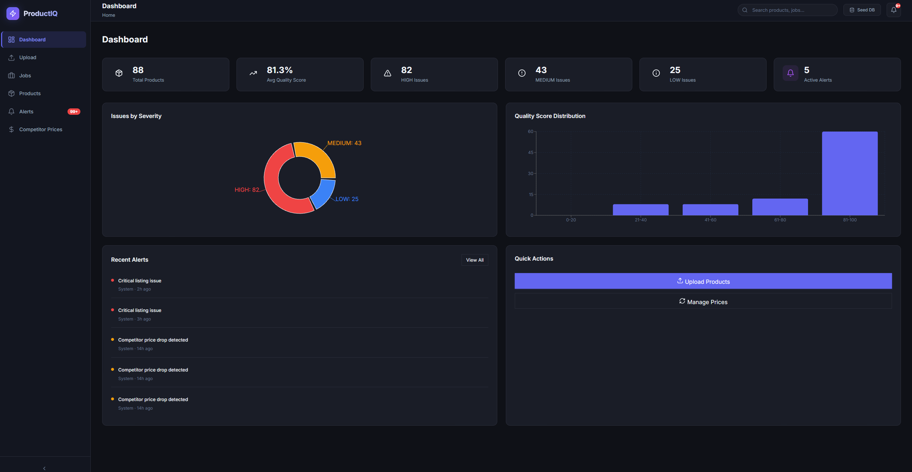

# Product Intelligence Dashboard



A full-stack, AI-powered platform for automated e-commerce product extraction, validation, and competitor pricing analysis.

---

## 🔗 Deployment Links

*   **Live Dashboard (Frontend)**: [Vercel Deployment](https://product-intelligence-dashboard-aw9mqc63r-artorias-66s-projects.vercel.app/)
*   **Live API (Backend)**: [Render Deployment](https://product-intelligence-api-dkuo.onrender.com)
*   **Interactive API Docs**: [Swagger UI](https://product-intelligence-api-dkuo.onrender.com/api/docs)

*(Note: The backend is hosted on Render's free tier. We utilize a GitHub Action cron job to ping the server every 14 minutes to prevent cold starts during your review!)*

---

## 🛠️ Tech Stack Used

**Frontend**
*   **React (Vite)**: For a fast, modern single-page application.
*   **React Router**: For client-side routing.
*   **Recharts**: For plotting competitor pricing trends and quality distribution.
*   **CSS3**: Custom glassmorphism design system (no Tailwind).

**Backend**
*   **FastAPI (Python 3.11)**: High-performance asynchronous API framework.
*   **SQLAlchemy (ORM)**: For robust relational database interactions.
*   **Pydantic**: For strict data validation and API schemas.

**AI & Computer Vision**
*   **OpenCV (`cv2`)**: Programmatic extraction of the middle frame from raw video uploads.
*   **Tesseract OCR**: Local text extraction to prevent AI hallucinations on model numbers.
*   **Groq LPU (Llama Vision)**: Lightning-fast primary reasoning engine for video product extraction.
*   **Anthropic Claude 3.5 Sonnet**: Primary reasoning engine for SEO title enhancement.
*   **Google Gemini 2.5 Flash**: Robust secondary fallback for both vision extraction and title enhancement with implemented exponential backoff.

**Infrastructure**
*   **Neon Serverless PostgreSQL**: Cloud database with connection pooling.
*   **Docker & Docker Compose**: Containerization for seamless local development.
*   **Vercel & Render**: Cloud hosting platforms.

---

## 🚀 How to Run Locally

You must have **Docker** and **Docker Compose** installed on your machine.

1. **Clone the repository:**
   ```bash
   git clone https://github.com/artorias-66/product-intelligence-dashboard.git
   cd product-intelligence-dashboard
   ```

2. **Configure Environment Variables:**
   Create a `.env` file inside the `backend/` directory and add your keys. 
   **IMPORTANT:** To run the AI extraction locally, you must generate and provide your own personal Google Gemini API key.
   ```env
   DATABASE_URL=postgresql://<user>:<password>@<neon-host>/neondb?sslmode=require
   GEMINI_API_KEY=your_personal_gemini_api_key_here
   ANTHROPIC_API_KEY=your_anthropic_api_key  # Optional fallback
   ```

3. **Spin up the Containers:**
   ```bash
   docker-compose up -d --build
   ```

4. **Access the Application:**
   * Frontend: `http://localhost:5173`
   * Backend API Docs: `http://localhost:8000/api/docs`

---

## 📖 How to Use the Deployed App

1. **Dashboard (`/`)**: View high-level metrics, active alerts, and quality score distribution.
2. **Upload (`/upload`)**: Upload a `.mp4` video or a `.csv` product feed. Toggle the **"Enhance Product Title"** flag if you want the LLM to generate SEO-optimized variants.
   * **Sample Files**: We have provided sample product videos and mock CSV data for your testing convenience inside the `backend/sample` directory!
3. **Jobs (`/jobs`)**: Monitor the asynchronous processing status. If a video extraction fails (e.g., OCR fails), the job enters a `PENDING_REVIEW` state where you can manually intervene.
4. **Products (`/products`)**: Filter, search, and view all ingested products. Click a product to see its **Competitor Price History** (visualized via Recharts) and recommended items.
5. **Alerts (`/alerts`)**: Review missing descriptions, low prices, or category anomalies flagged by the validation engine. Click an alert to jump directly to the product.

---

## 🔌 API Documentation

The full interactive API documentation is automatically generated by FastAPI.
Visit: **[https://product-intelligence-api-dkuo.onrender.com/api/docs](https://product-intelligence-api-dkuo.onrender.com/api/docs)**

**Core Endpoints:**
*   `POST /api/upload-video`: Accepts a video file, returns a `job_id` for polling.
*   `POST /api/upload-csv`: Accepts a CSV product feed, returns a `job_id` for polling.
*   `GET /api/jobs/{job_id}`: Poll for the asynchronous extraction status.
*   `GET /api/products`: List products with pagination, filtering, and search.
*   `GET /api/competitor-prices/product/{sku_id}/history`: Fetch mock historical pricing for Recharts.

---

## 🗄️ Data Model / Schema Explanation

The relational database is built on PostgreSQL with the following core entities:

1.  **Product**: The central entity (`sku_id`, `product_title`, `brand`, `category`, `price`, `description`, `quality_score`).
2.  **Job**: Tracks the asynchronous ingestion state (`status`, `type`, `error_message`, `draft_data`).
3.  **ProductIssue**: Tracks specific validation failures (e.g., "Missing description", "Price is zero"). One-to-many from Product.
4.  **Alert**: User-facing notifications generated by Issues. One-to-many from Product.
5.  **CompetitorPrice**: Tracks historical pricing across external platforms (Amazon, Myntra, etc.). Many-to-one from Product.
6.  **EnhancedTitle**: Stores SEO-optimized title variants generated by the LLM. One-to-many from Product.

---

## 🎭 What is Real vs. Mocked

**Real / Fully Functional:**
*   **Video Extraction**: The OpenCV + Tesseract + Gemini pipeline genuinely reads frames and extracts data dynamically.
*   **Database & Validations**: The Neon Postgres database is fully persistent. All quality scores, alerts, and schema validations are calculated in real-time.
*   **Title Enhancement**: The LLM actively generates SEO-optimized titles dynamically based on your toggle.
*   **Asynchronous Processing**: Background jobs actually process data asynchronously, utilizing polling on the frontend.
*   **Server Keep-Alive**: We successfully circumvented Render's 15-minute sleep limitation programmatically by implementing a GitHub Action cron job (`keep-alive.yml`) that pings the server 24/7.

**Mocked / Simulated:**
*   **Competitor Pricing**: Live web-scraping Amazon/Myntra is legally complex and unstable for a demo. Competitor data is simulated using randomized realistic data populated via the DB seeder and CSV uploads.
*   **Auth**: Authentication is omitted to simplify the reviewer experience.

---

## 🏗️ Assumptions Made

1.  **Video Format**: Assumes users are uploading short (under 60s) product showcase videos in standard `.mp4` format where the product is clearly visible in the middle frame.
2.  **Scale**: Assumes a B2B internal dashboard use-case, prioritizing data accuracy and validation workflows over high-concurrency consumer traffic.
3.  **LLM Reliability**: Assumes the Gemini/Claude API remains highly available. We implemented deterministic fallbacks (human review) to handle quota limits or hallucinations.

---

## ⚖️ Trade-offs and Limitations

*   **Single-Frame Extraction**: To save immense API costs and processing time, we only extract the *middle* frame of the video. If the product is only shown at the very beginning or end, the extraction will fail.
*   **Polling vs. WebSockets**: The frontend polls the `/jobs` endpoint every 2 seconds instead of using WebSockets. This was chosen for architectural simplicity on serverless deployments (Vercel/Render), but introduces slight overhead.
*   **Rate Limits**: The free tier of Gemini 2.5 Flash has strict Requests-Per-Minute (RPM) limits, which restricts how many videos can be uploaded simultaneously.

---

## 🔮 What I would improve with more time

1.  **Interactive Editing**: Adding a feature to let users directly edit and update product details (like name, ID, category) right from the dashboard instead of just analyzing them.
2.  **Live Competitor Scraping**: Replacing the mocked pricing with real-time competitor prices fetched securely via proxy networks.
3.  **Authentication & User Management**: Implementing robust user authentication (e.g., JWT or OAuth) to secure the dashboard and manage different user roles.
4.  **Historical Pricing Analytics**: Building out more advanced trend visualization for competitor prices over longer time horizons.
5.  **Background Worker Queues**: Replacing the backend threading with a robust distributed task queue like Celery & Redis for massive scalability.
6.  **Performance Optimization**: Reducing the startup delay and cold-start latency we are currently facing in the free-tier hosted version by upgrading the infrastructure.
